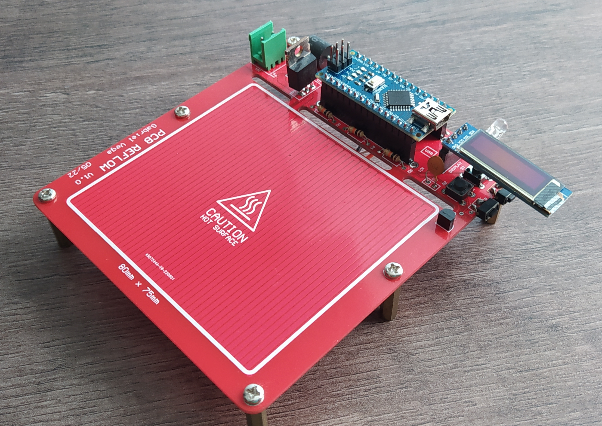
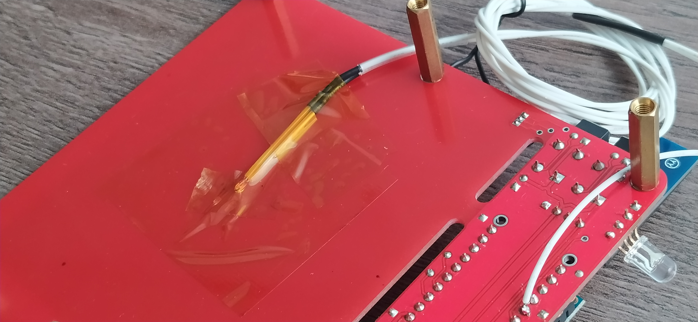

# PCB Reflow
 A PCB that can help you reflow and solder your SMD components! 

This project is my version of [AfterEarthLTD Solder Plate Reflow](https://github.com/AfterEarthLTD/Solder-Reflow-Plate) (which is an awesome project!). 

## V1.0 - Integrated Heating Bed with Arduino

I decided that I would first recreate the concept of the project (with the heating bed integrated) with more afordable component and add some more funcionality, so I used all PTH components and a Arduino Nano for the MCU (cheaper option for prototyping). 

</a>

The board has a bigger heating bed (80mm x75mm) and also implemented a RGB LED socket for easy signaling of the diffent stages of the reflow process.

### Documentation

- [Schematic](V1-Arduino-PTH/Documentation/Schematic_PCB_Reflow_Arduino_V1.0.pdf)
- [Layout](V1-Arduino-PTH/Documentation/Layout_PCB_Reflow_Arduino_V1.0.pdf)
- [3D View](V1-Arduino-PTH/Documentation/PCBReflow_V1_Arduino_Altium.png)
- [BOM](V1-Arduino-PTH/Documentation/BOM_PCB_Reflow_Arduino_V1.0.jpg)

### PCB Assembled

</a>
</a>

### Results & Performance

The board managed to heat at specific set temperatures. But appears to reach only around 190°C max. Any more than that the PCB solder mask will start to decay. If you want higher temperatures, other option for heating element is requiered. 

Also optimizing the firmware and the internal PID to follow the heating curve for the reflow is needed to have a more reliable reflow process.

### Modifications & Upgrades

The first item to be addresed is to change the position of the display connector. My first ideia is to create a 3D printed case to house the display and I would connect with wires. But while I was working on the firmware, the display was over the buttons, blocking them. Not good. So I used some 2 terminal push buttons on the side to help with that.

</a>

The second item is the temperature sensor. While the component itself works fine, the placement is not good. It doesnt give an accurate reading. I tried with an 100k thermistor under the heating bed and got much better results. So for next version I'll use thermistors.

</a>

### Final Thoughts

A good project to understand more about the hidden aspects of temperature measurement and control. Also a good practice of creating a unusual PCB shape. A new version of this design will be made. This project will work using low temperature solder paste, but if you want to use this as a heating element for higher temperatures, say for desoldering alluminium PCB, other option for heating element is requiered.

### References

 - [AfterEarthLTD Solder Plate Reflow](https://github.com/AfterEarthLTD/Solder-Reflow-Plate)

 - [GreatScott Solder Plate Reflow Review](https://www.youtube.com/watch?v=QarizoUnRfk&t)
